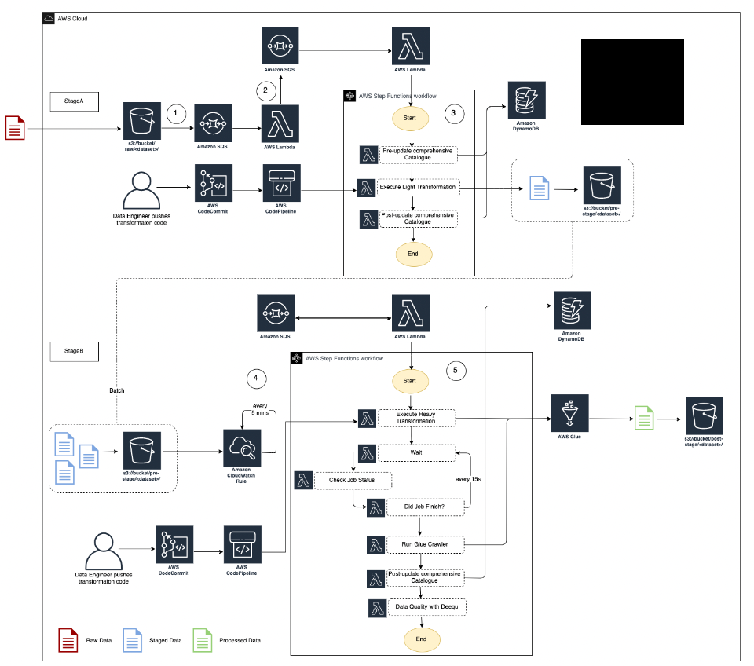

# Restarting With AWS Serverless Data Lake Framework

## Introduction

In this article we will discuss about AWS Serverless Data Lake Framework [link here], features, pitfalls and how to get started and install it really fast. SDLF, according to the readme on GitHub is an AWS Professional Services open source initiative. Citing the source:

"*The Serverless Data Lake Framework (SDLF) is a collection of reusable artifacts aimed at accelerating the delivery of enterprise data lakes on AWS, shortening the deployment time to production from several months to a few weeks. It can be used by AWS teams, partners and customers to implement the foundational structure of a data lake following best practices.*"

This is exactly what we were looking for to adopt, as a company wide framework, to get started with several clients in need of a new data-lake. SDLF proved to be an excellent starting point for our pipelines. Instead of just writing some glue jobs here and there and, when done trying to harden them and bring to a well-architected standard, we choose SDLF which firstly install a well-architected and hardened scaffolding, and then writing our glue jobs the right way to fit into this framework.

In terms of documentation, we found plenty to get us started. If you are not familiar with SDLF, here are every thing there is so far:

- website based on docs: <https://sdlf.readthedocs.io/>
- workshop: <https://catalog.us-east-1.prod.workshops.aws/workshops/501cb14c-91b3-455c-a2a9-d0a21ce68114/en-US>
- source code: <https://github.com/awslabs/aws-serverless-data-lake-framework>

However, here is a brief of how it works in our own words: SDLF comprises in a set of repositories that deploys a CICD ready (with CodeCommit, CodeBuild, CodePipeline and all) data lake pipeline scafolding and examples. Pipelines can contain multiple stages (default 2). The deployment considers multiple environments: shared environment, dev, test, prod environments. For a quick evaluation and get-started, shared and dev environments can be deployed on the same account.



The greatest advantage we saw in using SDLF was that it contains all things that we need in a data-lake other than the actual transformations. Here is the list of these things, or in other words, things we dont have to care about if using SDLF:

- highly secure design
- projects or repositories separated by functionality
- CICD pipelines ready made, that triggers by pull-request approval
- all data at rest between stages, and final stake encrypted
- tightly integrated with AWS Lake Formation. SDLF actually looks like a natural addition on top of Lake Formation. Final stage in data lake is added a Lake Formation database.

## Install SDLF

One of the first things we created around SDLF, is an ansible set of scripts for deploying it in one shot, and then completly destroing it in another shot. This would be the first step in having an automated testing procedure.

We published these changes as a new branch as part of forked SDLF repository on our GitHub account. This is available here:

<https://github.com/PredictIf/aws-serverless-data-lake-framework>

The install script deploys SDLF in a AWS account that plays SHARED and DEV environment roles. It will create CodeCommit replicas of several folders from the github original repo.

### Requirements

- A linux type of development environment where you will clone our branch. Cloud9 will work fine. I will not work on Windows due to limitations of the max number of characters a file path can have.
- Git
- Ansible
- Pyhon 3.8+
- Library: git-remote-codecommit
- AWS credentials profile pointing to an account to be used as SHARED and DEV environments for SDLF. It's important to mention that the region must be also configured as part of the profile.
- Premissions to the AWS account.

### 1. Clone the repo

```bash
#!/bin/bash
git clone https://github.com/PredictIf/aws-serverless-data-lake-framework.git
```

### 2. Edit specific variables

First, you would need to edit config file correctly, before launching the install. With your editor of choice, open and edit following files:

- `./ansible/environments/vars_common.yaml`
- `./ansible/environments/dev/vars-app.yaml`

[images here]

<!-- add permissions for lake formation -->

### 3 Launch the Ansible Playbook for Install

After you are sure you edited config files correctly, launch the ansible playboook:

```bash
cd ./ansible
ansible-playbook deploy.yaml
```

You should see something like this:
[screenshot ]

After about 1 hour, you should have SDLF foundations with an organization that you specified and a team that you specified and a simple 2 stages pipeline - deployed.

## Verify SDLF Installation

## Uninstall SDLF
